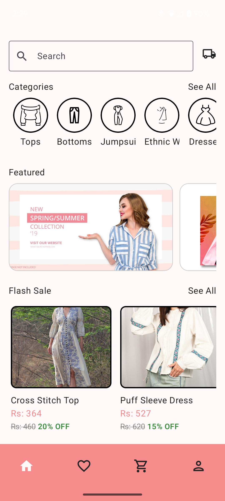
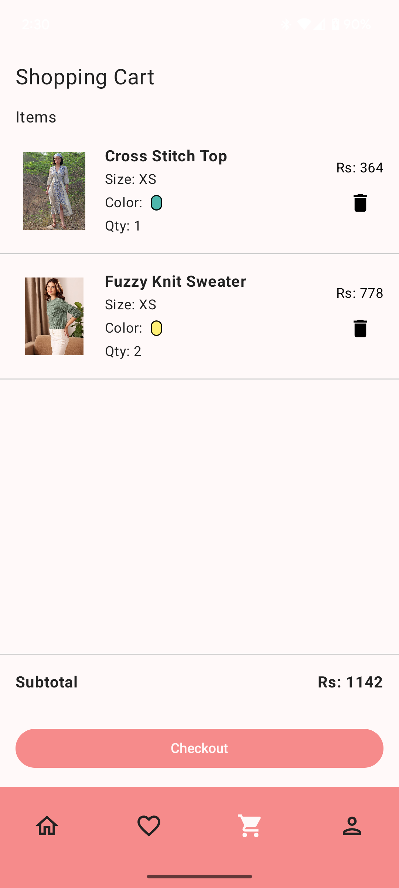

# 🛒 MyShop - E-Commerce User App

An end-to-end user-side e-commerce Android application built with modern Android development practices. Users can browse products, manage their profile, add to cart/wishlist, make secure payments, and view orders.

---

## 🚀 Features

- 🔐 **User Authentication** (Register / Login)
- 🧑‍💼 **Profile Management** with image upload
- 🔎 **Search Products** and Filter by Category
- 🛍️ **View Products** and Product Details
- ❤️ **Add to Wishlist** and **Cart**
- ❌ **Remove from Wishlist / Cart**
- 💳 **Razorpay Payment Gateway** integration
- ✅ **Place Orders** and View Order History
- 🔄 **Update Profile Info** and Profile Picture
- 🔔 **Firebase Cloud Messaging (FCM)** for Push Notifications
- 🔄 **Custom ResultState wrapper for handling external data calls

---

## 🧰 Tech Stack

| Layer                  | Tech Used                                      |
|------------------------|-----------------------------------------------|
| UI                     | **Jetpack Compose**                            |
| Language               | **Kotlin**                                     |
| Architecture           | **MVVM + Clean Architecture**                  |
| Dependency Injection   | **Dagger Hilt**                                |
| Async Handling         | **Kotlin Coroutines**, **Flow**, **callbackFlow** |
| Navigation             | **Jetpack Navigation Compose**                 |
| Image Upload & Fetch   | **Firebase Storage**                           |
| Database               | **Firebase Firestore**                         |
| Authentication         | **Firebase Auth**                              |
| Push Notifications     | **Firebase Cloud Messaging (FCM)**             |
| Payment Gateway        | **Razorpay SDK**                               |
| UX Enhancements        | **Splash Screen**                              |

---

## 🔒 Security

- 🔐 API Keys like Razorpay and Firebase `google-services.json` have been **removed from source control** for security.
- 📂 Make sure to **add your own `google-services.json`** file under `app/` folder before building the project.

---

## 📸 Screenshots

| Home Screen                          | Cart Screen                          |
|--------------------------------------|--------------------------------------|
|  |  |

---

## 🛠️ Getting Started

1. Clone this repo

git clone https://github.com/khushhal-mandal/myshop.git
cd myshop

2. Open in Android Studio
Android Studio will sync dependencies from your build.gradle files.
3. Add Required Files
🔑 Add your own Firebase google-services.json to /app/
🔐 Add razorpay key in MainActivity.kt and AndroidManifest.xml
4. Run the app
Use a physical device or emulator to run.

Made with ❤️ by Khushhal Mandal
